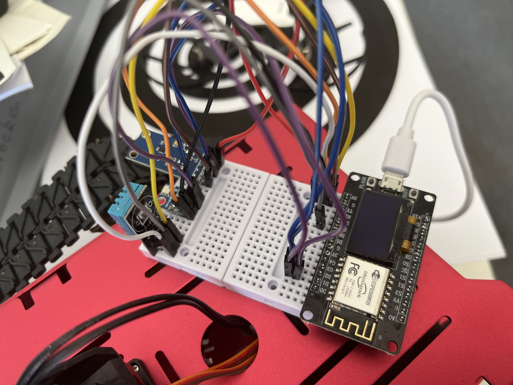

# How to use this
connect your ESP8266, DHT11 like this: 
<p align="left">
  
</p>
### Get drduino ide
```
git clone https://github.com/0YJ/ESP8266-DHT11.git
sudo apt update
sudo apt upgrade
sudo apt install arduino
```

### Install driver CH340/CH341 (drive is modified for GCC 13 on ubuntu, ready to use)
```
cd CH341SER_LINUX/driver
sudo make -j8
sudo make install
sudo dmesg
```

Then connect ESP8266, open IDE

```
arduino
```

File-Peference add addition [developing board](http://arduino.esp8266.com/stable/package_esp8266com_index.json) 

Toos-Boards-ESP8266-NODE MCU 1.0
Port: /dev/ttyCH341USB0

Update codes and do serial monitoring. 

# What to do next: 
Frontend, API, Database. 
# Future
Crazy sensors. 
